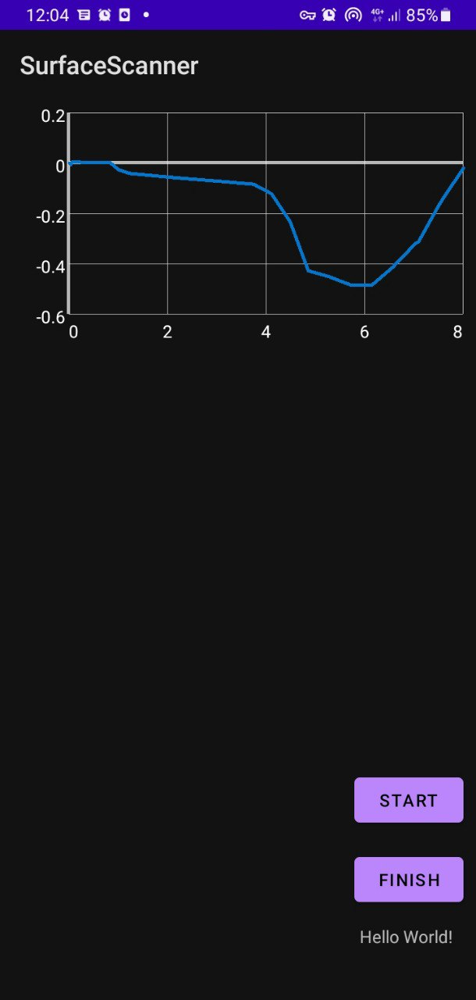

# SurfaceScanner

A simple android application to scan the surface for any ups and downs. You can run and build the project using android studio. The app uses your phone's accelerometer and gyroscope. 

## Usage

Running this application is a piece of cake!

1. Open the application

2. Press the START button

3. Scan a surface with your phone. 

4. Press the FINISH button. 

5. Your plot is ready!

Here is a sample run:

